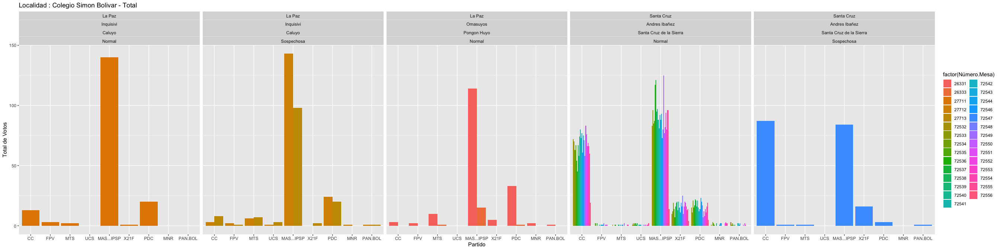
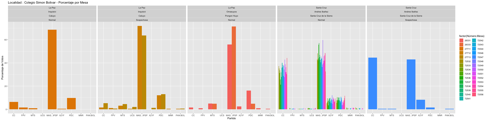

Bolivia Vota
================

This document summarizes our attempts at finding voting tampering in the
recent Bolivian elections. The datasets were obtained via the official
polling authority Organo Electoral Plurinacional (OEP) at the website
`http://computo.oep.org.bo`.

## 1\. Comparison between Valid Votes and Reports

For this comparison, we are considering two datasets

  - Results of the rapid counting process obtained on Sunday 22, October
    2019 at 20:38:53 (GMT-4) that we shall call **TREP** sample.
  - Results of the computations Friday 25 October 2019 at
    01:40:43(GMT-4), which we shall call the **pres** sample.

In what follows, we shall focus on the results for the election for
President and Vicepresident of the Plurinational State.

    ##    Min. 1st Qu.  Median    Mean 3rd Qu.    Max. 
    ##     0.0   189.0   201.0   187.6   209.0   256.0

``` r
actas_trep <- read.csv("./datasets/acta.2019.10.22.20.38.53.csv")

actas_pres_trep <- actas_trep %>%  
  filter(
    Elección  == "Presidente y Vicepresidente"
    ) 

actas_pres_trep$Votos.Partidos <- 
  actas_pres_trep[,partidos] %>% 
  rowSums()

actas_pres_trep$Votos.Emitidos <- 
  actas_pres_trep[,emitidos] %>% 
  rowSums()

actas_pres_trep$Diferencia.Partidos <- 
  actas_pres_trep$Votos.Partidos - actas_pres_trep$Votos.Válidos

actas_pres_trep %>% 
  mutate(
    Irreg = ifelse(
      Diferencia.Partidos!=0,"Irregular","Regular"),
    Sampl = "trep"
    ) -> actas_pres_trep
```

33901 33044

## Percieved Irregularities

``` r
actas_pres %>% 
  filter(Irreg=="Irregular")  %>%
  select(Diferencia.Partidos) %>%
  summary()
```

    ##  Diferencia.Partidos 
    ##  Min.   :-109.00000  
    ##  1st Qu.:  -8.00000  
    ##  Median :  -2.00000  
    ##  Mean   :  -0.05005  
    ##  3rd Qu.:   1.00000  
    ##  Max.   : 209.00000

``` r
actas_pres %>% 
  filter(Irreg=="Irregular")  %>%
  select(Diferencia.Partidos) %>%
  abs() %>%
  sum() 
```

    ## [1] 10338

``` r
actas_pres %>% 
  select(Votos.Emitidos) %>% 
  sum() 
```

    ## [1] 6358815

``` r
actas_pres_tidy <- actas_pres %>% melt(
  measure.vars  = 
    c("CC","FPV","MTS","UCS","MAS...IPSP","X21F","PDC","MNR","PAN.BOL"),
  variable_name= "Partido")
```

``` r
actas_pres_trep$Diferencia.Partidos <- 
  actas_pres_trep$Votos.Partidos - actas_pres_trep$Votos.Válidos

actas_pres_trep %>% 
  mutate(
    Irreg = ifelse(
      Diferencia.Partidos!=0,"Irregular","Regular") 
    ) -> actas_pres

## 

actas_pres_trep %>% 
  filter(Irreg=="Irregular")  %>%
  select(Diferencia.Partidos) %>%
  summary()
```

    ##  Diferencia.Partidos
    ##  Min.   :-115.000   
    ##  1st Qu.:  -9.000   
    ##  Median :  -3.000   
    ##  Mean   :  -1.552   
    ##  3rd Qu.:   1.000   
    ##  Max.   : 213.000

``` r
actas_pres_trep %>% 
  filter(Irreg=="Irregular")  %>%
  select(Diferencia.Partidos) %>%
  abs() %>%
  sum() 
```

    ## [1] 17091

``` r
actas_pres_trep %>% 
  select(Votos.Emitidos) %>% 
  sum() 
```

    ## [1] 6194344

``` r
actas_trep_tidy <- actas_pres_trep %>% melt(
  measure.vars  = 
    c("CC","FPV","MTS","UCS","MAS...IPSP","X21F","PDC","MNR","PAN.BOL"),
  variable_name= "Partido")
```

## 2\. Overviewing voting per Polling Districts

In this part, we try to check whether there is a difference between the
results of voting at each booth within a precint and the results of the
precint. One would expect that the distribution of the former is somehow
reflective of the latter. This can be assessed graphically or via
testing procedures with the respective corrections.

However, booths with a small amount of voters:

1.  Could have a problem reflecting the distribution of the precint as
    they are small samples.
2.  Hinder the statistical testing process.

To adress the first

``` r
ComoVotaMiRecinto <- function(recinto, porcentajes =FALSE){
   if(!(recinto %in% levels(actas$Recinto))) {
     stop(message("Nombre de recinto no valido."))
   } else {
     data <- actas_pres %>% melt(
       measure.vars  = partidos,
       variable_name= "Partido") %>%
       mutate(Porcentaje.por.Partido =  value/Votos.Emitidos*100) %>%
       filter(
         Recinto  == recinto) %>%
       group_by(Número.Mesa, Partido)
       
       if(!porcentajes){
        plots <- data %>% 
          ggplot(mapping = aes(x = Partido, 
                               y=value, 
                               fill = factor(Número.Mesa))) +
          geom_col(position ="dodge")+
          facet_grid(.~Departamento+Provincia+Localidad+Irreg, 
                     scales = "free_y") + 
          ggtitle(paste("Localidad :", recinto, "- Total")) + 
          labs(x = "Partido", y = "Total de Votos")
       } else if (porcentajes){
         plots <- data %>% 
           ggplot(mapping = aes(x = Partido, 
                                y = Porcentaje.por.Partido, 
                                fill = factor(Número.Mesa))) +
           geom_col(position ="dodge")+
           facet_grid(.~Departamento+Provincia+Localidad+Irreg, scales = "free_y") + 
           ggtitle(paste("Localidad :", recinto, "- Porcentaje por Mesa"))+ 
           labs(x = "Partido", y = "Porcentaje de Votos")
       }
     plots
   }
}
```

### Some Examples

<!-- --><!-- -->
